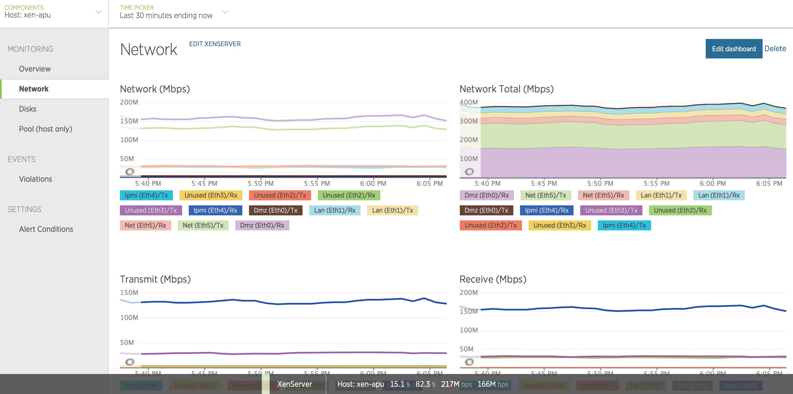

# Description

XenServer Monitor Plugin for Newrelic
Fetches metrics from Xen Hosts and VM and pushes to NewRelic over https.

- CPU Usage
- Memory Usage
- Network Activity (Rx/Tx Mbps per interface)
- Drive Activity (Throughput, IOPS, IO Wait, Latency)
- Xen Hosts Data (XAPI Memory, dom0 load)

The amount of metrics available will depend on your XenServer version.
The module has been tested with Xen 6.2, 6.5 and 7.0.

----

# Requirements

- Node.JS/NPM
- XenServers

----

# Installation

- Install NodeJs and NPM [Download](https://nodejs.org/en/download/package-manager/)
- Download plugin from GitHub and extract
- Inside the plugin directory, install the required npm modules (npm install async xen-api xml2js)

Configure

- xenConfig
- Pool Master(s)
- Username/Password (Same as XenCenter)
- Specify timezone offset in tzOffset (if the timezone differs between the node.js server vs XenServers)

- newRelicConfig
- Newrelic license key and host name of the server this script will run it.

We use [PM2](http://pm2.keymetrics.io) as a node process manager, which enables node.js script to run forever,
gather logs, and to run at boot.

npm install pm2@latest -g
pm2 start xen_monitor.js

pm2 stop 0
pm2 restart 0
pm2 reload 0

To start at boot: pm2 startup, followed by pm2 save

---

# License

As-Is. Use at your own risk etc.

----

# Support

Report issues on [GitHub Issues tracker](https://github.com/mobilenations/newrelic_xenserver/issues)

----